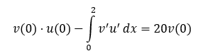
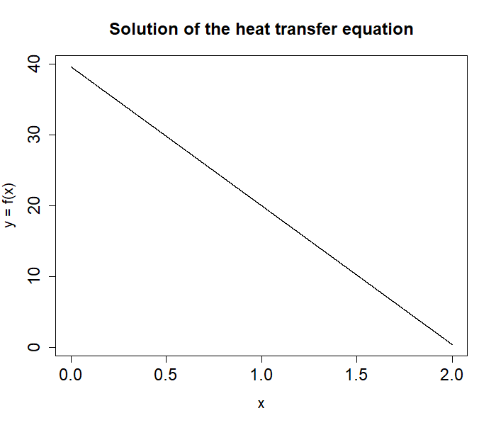

# Rozwiązanie równania różniczkowego metodą elementów skończonych

## 1. Sformułowanie wariacyjne równania transportu ciepła

Wyprowadzenie sformułowania można znaleźć [tutaj](./SformułowanieWariacyjne.pdf)

## 2. Rozwiązanie równania i rysowanie wykresu

    Enter number of elements: 100

